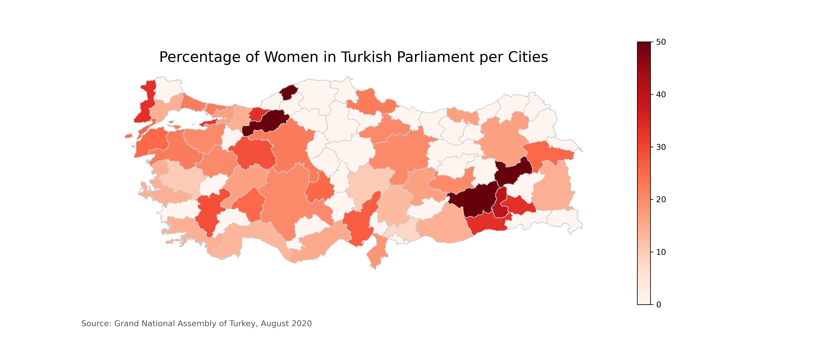

# TBMM'de Yer Alan Kadın Vekillerin İllere Göre Yüzdesel Dağılımı
# (Percentage of Women in Turkish Parliament per Cities)

Python'da GeoPandas ile harita gösterimi üzerine hazırlanmış kısa bir proje.

Proje ile ilgili detaylı bilgiye <a href='http://yurduseven.net/tbmmdeki-kadin-milletvekillerinin-illere-gore-dagilimi/'>buradan</a> erişebilirsiniz.

